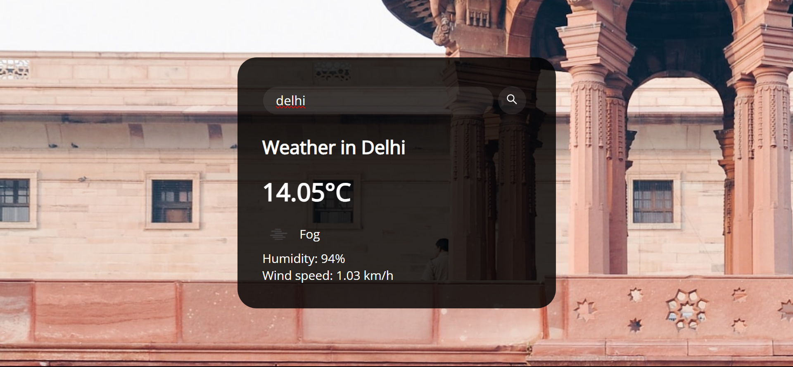

# Weather App

This Weather App fetches weather details using the OpenWeatherMap API based on the searched cities. It displays temperature, humidity, and wind speed details while dynamically changing the background image to represent the searched location.

Access the live Weather App here: [Weather App Demo](https://bits-and-atoms.github.io/Weather-App/)

## Features

- **Search Cities:** Allows users to search for weather details by city name.
- **Display Weather Data:** Shows temperature, humidity, and wind speed details.
- **Dynamic Background:** Changes the background image based on the searched location.

## Technologies Used

- HTML
- CSS
- JavaScript
- OpenWeatherMap API

## How to Use

1. Access the [Weather App](https://bits-and-atoms.github.io/Weather-App/).
2. Enter the name of the city you want to get weather details for in the search field.
3. Press the search/submit button or hit Enter.
4. View the displayed weather details along with the dynamically changed background image.

## Screenshots

## How to Contribute

If you want to contribute to this project, you can follow these steps:

1. Fork the repository.
2. Create a new branch (`git checkout -b feature/improvement`).
3. Make your changes and commit them (`git commit -am 'Add new feature'`).
4. Push to the branch (`git push origin feature/improvement`).
5. Create a new Pull Request.

## Credits

- This project uses the [OpenWeatherMap API](https://openweathermap.org/api) to fetch weather data.
